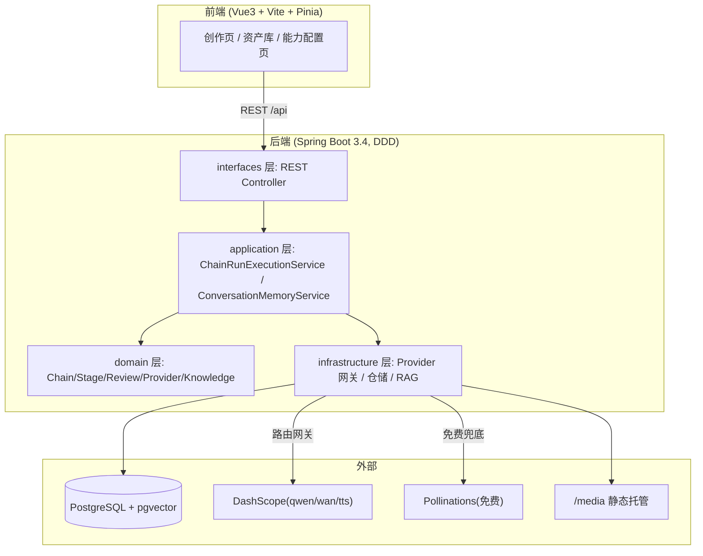

# AImv · 多 Agent 创意生成编排平台

> 一个 **provider 无关** 的多 Agent 编排后端 + Vue3 前端：把「一句话创意」经过 **检索增强(RAG) → 多阶段 Agent 链路 → 结构化产出 → 质量门禁 → 交付** 的固定流水线，生成**图片**或**带配音的短视频**，并支持**连续多轮对话创作**（带上下文压缩记忆）。

<p align="center">
  
  
  
  
  
</p>

<p align="center">
  <br>
  <sub>▲ 前端输入一句文案 → 经 RAG + 多阶段 Agent 链路生成的图片示例（DashScope 出图，自动转存 /media 永久托管）</sub>
</p>

---

## 目录

- [🚀 一键 Docker 运行（最快）](#-一键-docker-运行最快)
- [这个项目在做什么](#这个项目在做什么)
- [先补：Agent 零基础 5 分钟入门](#先补agent-零基础-5-分钟入门)
- [核心特性](#核心特性)
- [系统架构](#系统架构)
- [技术栈](#技术栈)
- [目录结构](#目录结构)
- [快速开始（手把手，含实习生复现步骤）](#快速开始手把手含实习生复现步骤)
- [配置生成模型的 API Key](#配置生成模型的-api-key)
- [工作原理详解](#工作原理详解)
- [REST API 速览](#rest-api-速览)
- [开发指南](#开发指南)
- [常见问题排查](#常见问题排查)
- [优化方向 / Roadmap](#优化方向--roadmap)
- [安全须知](#安全须知)
- [许可协议](#许可协议)

---

## 🚀 一键 Docker 运行（最快）

不想装 JDK / Node / Postgres？**只要有 Docker**，一条命令把「数据库 + 后端 + 前端」全跑起来：

```bash
git clone <你的仓库地址> aimv && cd aimv/AImv

# （可选）自定义本地数据库口令：复制 .env.example 为 .env 改一下
cp .env.example .env

docker compose up -d --build
```

- 首次会自动：用 **Maven+JDK17** 编译后端、用 **Node** 构建前端、拉起 **pgvector** 数据库并 Flyway 建表。
- 完成后浏览器打开 **<http://localhost:8080>** 即可用（前端 Nginx 已反代 `/api`、`/media` 到后端，前后端同源）。
- 停止：`docker compose down`；连数据一起清：`docker compose down -v`。

**镜像里包含的全部环境**：Java 17(JRE) + ffmpeg（视频合成）、Node 构建产物、Nginx、PostgreSQL 16 + pgvector。你无需在本机装任何东西。

> **关于 API Key**：镜像与仓库**不含任何模型 Key**。启动后在前端「能力配置」页录入你自己的 Key（AES 加密入库，`credkey` 卷持久化）。见 [配置生成模型的 API Key](#配置生成模型的-api-key)。
>
> **安全**：`docker-compose.yml` 里的数据库口令是**仅本地用的占位默认**（`aimv_local_dev`），生产/公开部署请用 `.env` 覆盖为随机值；镜像通过 `.dockerignore` 排除了本地媒体/日志/密钥，不含任何个人或主机信息。

| 服务 | 端口 | 说明 |
| --- | --- | --- |
| frontend (nginx) | `8080` | 浏览器入口 |
| backend (Spring Boot) | 容器内 8081（默认不外露，走前端反代） | 需直连调试可在 compose 放开 `ports` |
| postgres (pgvector) | 容器内 5432 | 数据存 `pgdata` 卷 |

> 想手动分别跑（不用 Docker）见下方 [快速开始](#快速开始手把手含实习生复现步骤)。

---

## 这个项目在做什么

你在前端输入一句创意（例如「一只在雪地里的金色柴犬，电影感」），选择「图片生成」或「视频生成」，系统会自动走一条**固定的多阶段流水线**：

```
用户目标 → 目标锁定 → 检索历史/知识(RAG) → 提示词工程 → 能力预检 → 调用生成模型 → 质量评审 → 交付固化
```

每个阶段由一个或多个 **Agent 节点** 完成，产出都要过 **质量门禁**（不达标会自动重试或换凭证），最终把「产物 + 验收报告」持久化。你还能在**同一段对话里连续追问**（"给它戴顶帽子"→"换成夜景"），系统会带着**压缩后的上下文记忆**让模型延续创作。

> 它不是"调一次大模型 API"的玩具，而是一套**可观测、可复算、provider 可替换、带质量门禁与重试**的生产级编排骨架。视频/图片的具体生成模型只是流水线里**可插拔的一环**——你可以把 DashScope 换成 Sora / Gemini / Imagen。

---

## 先补：Agent 零基础 5 分钟入门

如果你没接触过 AI Agent，先理解这几个词，后面就不会懵：

| 术语 | 一句话解释 | 在本项目里对应 |
| --- | --- | --- |
| **LLM** | 大语言模型（如 qwen/GPT），输入文字输出文字 | 用于剧本/提示词扩展、目标锁定 |
| **Agent（智能体）** | 让 LLM «按指定角色、产出指定格式» 完成一个子任务的封装 | 一个阶段里的「目标 Agent / 提示词 Agent / 视觉 Agent」 |
| **Chain（链路）** | 把多个 Agent 按固定顺序串起来，前一步产出喂给后一步 | `I00→I10→…→I60`（图片）/ `V00→…→V60`（视频） |
| **结构化输出** | 强制 LLM 返回 JSON（而非自由文本），便于程序解析 | `LlmStructuredOutput`：JSON schema + 解析 + 重试 |
| **RAG（检索增强生成）** | 先从知识库/历史里检索相关内容，再让 LLM 参考着生成 | pgvector 向量检索 + 关键词混合 + 重排 |
| **质量门禁（Review Gate）** | 用固定评分规则/视觉模型给产物打分，不达标就打回 | `StageReviewPolicy`：评分 0-100，不过则重试 |
| **Provider 抽象** | 把「调用哪个厂商的模型」与「业务逻辑」解耦 | `RoutingProviderHttpGateway` + 能力槽 |

**一句话**：本项目 = 「一条把 LLM 各子任务(Agent) 串起来、每步都检索+校验、最终产出图/视频」的流水线，且底层用哪个模型可随时替换。

---

## 核心特性

- 🧩 **多阶段 Agent 链路**：图片/视频各 7 个固定阶段，`StageCoordinator` 协调、每阶段独立评审。
- 🔎 **真实 RAG**：pgvector 向量检索 + 关键词混合（RRF 融合）+ 重排（rerank），带 Recall@K/MRR 评测 harness。
- 📐 **结构化 LLM 输出**：JSON schema 提示 + 容错解析 + 重试，避免自由文本不可控。
- 🔌 **Provider 无关**：DashScope / Pollinations(免费) / Fixture(离线确定性) 三套网关，能力槽路由，加厂商只需加一个 gateway。
- 🚦 **质量门禁 + harness 重试**：评分不达标时**同阶段自动重试**（应对 LLM 输出随机性），质量评审阶段还会**换备用凭证**重生成。
- 🗣️ **连续多轮对话 + 上下文压缩**：同一项目下多轮创作，超上下文阈值时用 LLM **语义压缩旧轮次**（保住主体/风格锚点，不丢关键信息）。
- 💾 **持久化不丢历史**：PostgreSQL 持久化 chain run / 产物 / 阶段；生成的图/视频从会过期的 OSS 链接**转存到本地 `/media` 永久托管**。
- 🔐 **凭证加密**：用户 API Key 经 AES 加密入库，前端只见脱敏值。
- 🏛️ **DDD / 六边形架构**：`interfaces / application / domain / infrastructure` 分层清晰，60+ 领域类、26 个测试。

---

## 系统架构



**链路阶段（以图片为例，视频同构为 V00~V60）**：

```
I00 目标锁定 → I10 检索/知识 → I20 提示词工程 → I30 能力预检
   → I40 调用生成模型 → I50 质量评审 → I60 交付固化
```

---

## 技术栈

| 层 | 技术 |
| --- | --- |
| 后端 | Java 17、Spring Boot 3.4.4、Spring Web / JDBC、Flyway、Maven（含 `mvnw` wrapper） |
| 数据库 | PostgreSQL 16 + **pgvector**（向量检索） |
| 前端 | Vue 3.5、Vite 8、TypeScript 6、Pinia 3、Vue Router 4 |
| 模型 provider | DashScope（qwen-plus 文本 / wan2.6-t2i 图片 / wanx2.1-t2v-turbo 视频 / qwen-tts 配音 / text-embedding）、Pollinations（免费兜底）、Fixture（离线确定性） |
| 媒体处理 | ffmpeg（视频合成/转码，视频链路需要） |

---

## 目录结构

```
AImv/
├── backend/                         # Spring Boot 后端
│   ├── src/main/java/com/aimv/
│   │   ├── interfaces/              # ① 接口层：REST Controller、DTO、Web 配置
│   │   ├── application/             # ② 应用层：用例编排（链路执行、对话记忆…）
│   │   │   ├── chain/               #    ChainRunExecutionService（链路核心引擎）
│   │   │   ├── conversation/        #    ConversationMemoryService（多轮记忆压缩）
│   │   │   └── config/              #    ApiKeyProtector（AES 加密）等
│   │   ├── domain/                  # ③ 领域层：Chain/Stage/Review/Provider/Knowledge 模型 + 仓储接口
│   │   └── infrastructure/          # ④ 基础设施层：Provider 网关、Postgres/内存 仓储、RAG 实现
│   │       └── http/                #    RoutingProviderHttpGateway、DashScope*/Pollinations* 网关
│   ├── src/main/resources/
│   │   ├── application.yml          #    主配置
│   │   ├── application-postgres.yml #    postgres profile（持久化）
│   │   └── db/migration/            #    Flyway：V1 建表+pgvector / V2 / V3 软化外键
│   ├── run-backend.sh               #    一键以持久化模式启动
│   └── pom.xml
├── frontend/                        # Vue3 前端
│   └── src/
│       ├── pages/                   #    WorkspacePage(创作)/AssetsPage(资产)/CapabilityConfigPage(能力配置)
│       ├── stores/                  #    Pinia：useChainRunStore（含连续对话/轮询/记忆压缩）
│       ├── components/              #    composer / workspace / capability / shell
│       └── api/                     #    REST 封装
└── docs/                            # 设计文档
```

**四层依赖方向**：`interfaces → application → domain ← infrastructure`（domain 不依赖任何框架，最纯净；infrastructure 实现 domain 定义的仓储/网关接口）。这是**六边形/DDD** 的标准分层——新人读代码从 `interfaces` 的 Controller 入手，顺着 `application` 的 Service 往下看即可。

---

## 快速开始（手把手，含实习生复现步骤）

> 目标：从零把项目跑起来，在浏览器里生成一张图片。预计 15 分钟。

### 0. 前置依赖

| 依赖 | 版本 | 检查命令 |
| --- | --- | --- |
| JDK | 17+ | `java -version` |
| Node.js | 18+ | `node -v` |
| Docker | 任意近版 | `docker -v` |
| ffmpeg | 任意近版（视频链路才需要） | `ffmpeg -version` |

> Maven 不用单独装，仓库自带 `./mvnw` wrapper。

### 1. 克隆

```bash
git clone <你的仓库地址> aimv
cd aimv/AImv        # 若仓库根就是 AImv 可省略
```

### 2. 启动 PostgreSQL（pgvector）

用 Docker 一条命令拉起（**端口 55432**，避免和本机其它 5432 冲突）：

```bash
docker run -d --name aimv-pgvector \
  -p 55432:5432 \
  -e POSTGRES_USER=aimv -e POSTGRES_PASSWORD=aimv -e POSTGRES_DB=aimv \
  pgvector/pgvector:pg16
```

> 建表和 pgvector 扩展由后端启动时的 **Flyway 自动迁移** 完成，你无需手动建表。

### 3. 启动后端（持久化模式）

```bash
cd backend
bash run-backend.sh          # 内部已带 --spring.profiles.active=postgres，端口 8081
```

看到 `Started AimvApplication` 即成功。验证：

```bash
curl http://127.0.0.1:8081/api/projects       # 返回 {"success":true,"data":[...]}
```

> `run-backend.sh` 首次会自动用 `mvnw` 构建 jar。也可手动：`./mvnw -q package -DskipTests` 后 `java -jar target/aimv-backend-0.1.0-SNAPSHOT.jar --spring.profiles.active=postgres`。

### 4. 启动前端

```bash
cd ../frontend
npm install
npm run dev                  # 端口 5173
```

浏览器打开 <http://127.0.0.1:5173> 。

### 5. 配置一个生成模型的 Key 并生成

见下一节「配置生成模型的 API Key」。配好后在创作页输入文案 → 选「图片生成」→ 发送 → 稍等即出图，资产库可见。

> **完全离线体验**：不想配任何 Key？后端默认带 `fixture`（确定性假产物）与 `pollinations`（免费 keyless）能力，链路能跑通（产出占位/免费图），适合先摸清流程再接真实模型。

---

## 配置生成模型的 API Key

系统所有生成能力都通过 **「能力配置」页** 录入 Key，**不需要改代码、不需要写死密钥**。

1. 前端左侧进入 **能力配置**，切换「图片链路 / 视频链路」。
2. 每个能力项（如 `llm.text.free`、`image.generate.free`）点 **添加 Key**，填：
   - **Provider**：如 `dashscope` / `pollinations`
   - **Model**：如 `qwen-plus`（文本）、`wan2.6-t2i`（图片）、`wanx2.1-t2v-turbo`（视频）
   - **API Key**：你自己的密钥（明文只提交一次，后端 AES 加密入库）
3. 点 **测试** → **设为使用中**（启用）。

**推荐可跑通的一套配置（以 DashScope 为例）**：

| 链路 | 能力 | Provider | Model |
| --- | --- | --- | --- |
| 图片/视频 | `llm.text.free` | dashscope | `qwen-plus` |
| 图片 | `image.generate.free` | dashscope | `wan2.6-t2i` |
| 视频 | `video.generate.full_with_voice.free` | dashscope | `wanx2.1-t2v-turbo` |
| （RAG 内部件）| `rag.embedding.free` / `rag.rerank.free` | 保持 fixture 即可（确定性、免费） | — |

> 免费方案：图片能力可用 Provider=`pollinations`、Model=`flux`（keyless，Key 随便填占位）。

> **重要坑点**：DashScope 图片网关走 `multimodal-generation` 端点，只认 `wan2.6-t2i`；`wanx2.1-t2i-turbo` 是另一个端点，配错会报 `DASHSCOPE_IMAGE_PROVIDER_UNAVAILABLE`。

---

## 工作原理详解

### 1）链路引擎 `ChainRunExecutionService`
- 按 `StageCatalog` 定义的阶段顺序逐个执行 `buildStage`，**每阶段完成即落库**（前端可轮询看到逐阶段进度）。
- **异步**：`start` 立即返回 `EXECUTING`，后台线程推进。
- **harness 重试**：
  - 非质量评审阶段（如 I00 目标锁定）因 LLM 输出偶发缺字段导致评审不达标 → `buildStageWithReviewRetry` **同阶段重试至多 3 次**。
  - 质量评审阶段（I50/V50）不达标 → **重生成 + 复审**，仍不过则**换备用凭证**，最后收敛为可重试的软状态（不崩溃、不给用户暴露技术细节）。

### 2）结构化输出 `LlmStructuredOutput`
- 给 LLM 注入 JSON schema 提示，要求只输出 JSON；解析时**容错**（截断也尽量救回）、失败重试。

### 3）RAG 检索
- 入库时算 embedding 存 pgvector；检索时 **向量余弦 + 关键词重叠** 双路，用 **RRF** 融合，再 **rerank**；有独立评测（Recall@K / Precision@K / MRR）。

### 4）Provider 抽象与路由
- `RoutingProviderHttpGateway` 按 `capabilityType` + `provider` 名分发到具体网关；能力槽（能力配置页）决定用哪个厂商/模型。
- 加一个新厂商（如 Sora）= 写一个 `XxxProviderHttpGateway` + 在路由里注册 + 前端配 Key，**不动业务逻辑**。

### 5）质量门禁 `StageReviewPolicy`
- 按固定 rubric 加权算分（0-100，已 `clampScore` 钳制防越界），图片看视觉/目标匹配/一致性/完整性，视频还看运动/配音/连贯/时长。
- 视频/图片评审可接 **qwen-vl 视觉模型** 真看图打分（非拍脑袋）。

### 6）连续对话记忆 + 压缩
- 同一 `projectId` 的多次链路 = 一段对话；前端把各轮原始请求发到 `POST /api/conversation-memory`。
- `ConversationMemoryService`：不超阈值全量拼接；超阈值时**最近 N 轮 verbatim + 旧轮用 qwen 语义压缩成一句「已确立设定」**（保主体/风格/角色），LLM 不可用回退启发式保锚点。

### 7）媒体永久托管
- DashScope 返回的图片/视频是**会过期的 OSS 预签名链接** → `MediaRehoster` 下载转存本地 `storage/media`，返回 `/{public-base}/media/...` 永久 URL，历史产物不再"预览不可用"。

---

## REST API 速览

| 方法 & 路径 | 说明 |
| --- | --- |
| `POST /api/projects` | 新建项目 |
| `GET /api/projects` | 项目列表（带 `latestChainRunId` 供前端历史点击） |
| `POST /api/projects/{id}/image-chain-runs` | 启动图片链路 |
| `POST /api/projects/{id}/video-chain-runs` | 启动视频链路 |
| `GET /api/chain-runs/{id}` | 查链路状态/阶段/产物（前端轮询） |
| `POST /api/stage-runs/{id}:redo` | 重做某阶段 |
| `GET /api/artifacts` | 全部产物（资产库） |
| `GET /api/api-configs?chainType=IMAGE` | 某链路的能力槽与已配 Key |
| `POST /api/api-configs/{chainType}/{capabilityType}/keys` | 添加 Key |
| `POST /api/api-keys/{id}:verify` / `:select` | 测试 / 启用 Key |
| `POST /api/conversation-memory` | 多轮对话记忆压缩 |
| `GET /media/**` | 生成的图/视频静态托管 |

---

## 开发指南

```bash
# 后端全量测试
cd backend && ./mvnw test

# 后端仅编译打包
./mvnw -q package -DskipTests

# 前端类型检查 / 构建
cd frontend && npx tsc -b && npm run build
```

**加一个新的模型 Provider（例：接 Sora 视频）**：
1. 在 `infrastructure/http/` 写 `SoraVideoProviderHttpGateway`（实现 `supportsCapability` + `invoke`）。
2. 在 `RoutingProviderHttpGateway` 构造里注册，路由分发时按 `provider` 名匹配。
3. 前端「能力配置」里 `video.generate...` 添加 Provider=`sora` 的 Key 并启用。
4. 业务链路、评审、前端**一行不用改**。

---

## 常见问题排查

| 现象 | 原因 & 解决 |
| --- | --- |
| 后端起不来 / 连不上库 | 确认 `aimv-pgvector` 容器在 **55432**（不是 5432）。`docker ps` 查看 |
| 生成"系统处理失败" | 多为未配可用 Key。去能力配置页添加并**设为使用中** |
| `DASHSCOPE_IMAGE_PROVIDER_UNAVAILABLE` | 图片模型要用 `wan2.6-t2i`（网关端点只认它） |
| 偶发 `scene must not be blank` 后成功 | LLM 输出随机性，harness 已自动重试；仍失败点「再次生成」 |
| 历史图片"预览不可用" | 老数据是过期 OSS 链接；新生成已转存 `/media` 永久托管 |
| 图/视频在框里变形 | 已用 `object-fit: contain`；点「⤢放大」看原图 |

---

## 优化方向 / Roadmap

- [ ] **视频模型升级**：接入 **Sora / Veo / Kling 2.0**——当前 `wanx i2v/t2v` 只能出 ~5s 片段靠拼接，长镜头时间连贯性是最大瓶颈（投入产出比最高的一步）。
- [ ] **跨镜头人物锁定**：参考图 / 末帧接力 conditioning，保证同一角色跨场景不漂移。
- [ ] **口型同步**：接 Wav2Lip / SadTalker 类模型，说话镜头对口型。
- [ ] **多 Agent 剧情扩展落地后端**：把「分块器 + 环境/人物/声音/特效并行扩展 Agent → 制作圣经」的编排从原型迁进 Java 链路（V10/V20）。
- [ ] **分布式与可观测**：任务队列（多实例并发）、指标/链路追踪、结构化日志。
- [ ] **评估体系**：agent 产出的自动化评测集 + 回归基线。
- [ ] **上下文记忆升级**：向量化会话记忆 + 更细的 token 预算控制。
- [ ] **前端**：多轮消息流已做，可继续做真·流式输出、断点续跑、协作。

---

## 安全须知

- ⚠️ **绝不要把任何真实 API Key 提交进仓库**。本项目所有 Key 通过「能力配置」页在运行时录入，AES 加密后入库（密钥文件在 `~/.aimv/credential.key`，不入库）。
- `.gitignore` 请确保忽略：`storage/`、`~/.aimv/`、任何 `*.env` / `*.key`、`node_modules/`、`target/`。
- 部署时用环境变量注入敏感配置（如 `AIMV_DASHSCOPE_API_KEY`、`AIMV_POSTGRES_*`），不要写进 `application.yml` 提交。
- 前端只接收**脱敏** Key，明文只在录入时传一次。


---

> 本项目是一套**编排骨架**：亮点在多 Agent 链路、RAG、结构化输出、provider 抽象、质量门禁与重试、连续对话记忆等**系统工程**，底层生成模型可自由替换。欢迎 issue / PR。
